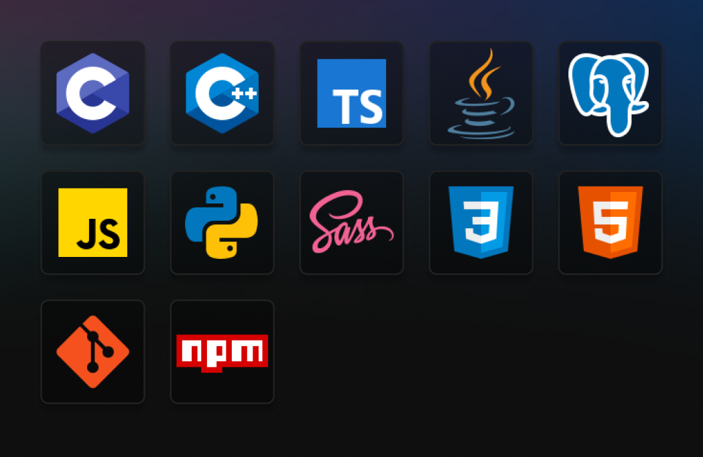
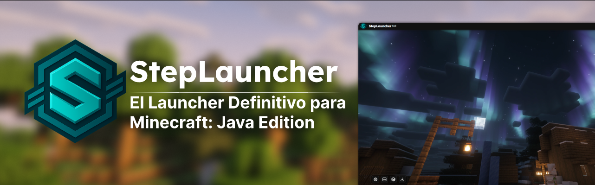

  

  # Santiago Nicolás Stepnicka
  ### Desarrollador Fullstack | Creador de NovaStepStudios

   

  

## ⚡ Sobre Mí

Soy un apasionado por transformar ideas en herramientas **rápidas, modulares y profesionales**. Mi especialidad es el desarrollo de aplicaciones de escritorio y herramientas para gaming, con un fuerte enfoque en la experiencia de usuario y la arquitectura de software.

* **Electron Apps:** Potentes y visualmente impecables.
* **Minecraft Tech:** Launchers y gestión de instancias.
* **Node.js:** Módulos avanzados y arquitecturas escalables.
* **TypeScript:** Código robusto y tipado.

## 🛠️ Stack Tecnológico

<h1>Lenguajes</h1>

<h1>Entornos, Nube y Herramientas</h1>

## 🚀 Proyectos Destacados

  
    
  
  **Launcher profesional de Minecraft creado en Electron.**
   
  *Enfoque en rendimiento, diseño moderno y arquitectura extensible.*

   

  

  

  
   
  Módulo avanzado para el descubrimiento, descarga y ejecución de Minecraft.
  
  

    <code>Cliente</code> • <code>Assets</code> • <code>Librerías</code> • <code>Nativos</code> • <code>Java Runtimes</code> • <code>Mod Loaders</code>
  

  
  
  

 
<h1 align="center">📊 Estadísticas de GitHub<h1>

  

    
    
  

<h1 align="center">🌐 Conectemos<h1>

  
  
  
  

  
  <h5>❤️ Apoya el desarrollo</h5>
  
Si mis herramientas te han sido útiles, considera invitarme un café para seguir creando.

  
Mercado Pago (Argentina)

  
CVU: 0000003100051190149138 | Alias: stepnickasantiago

   

  

